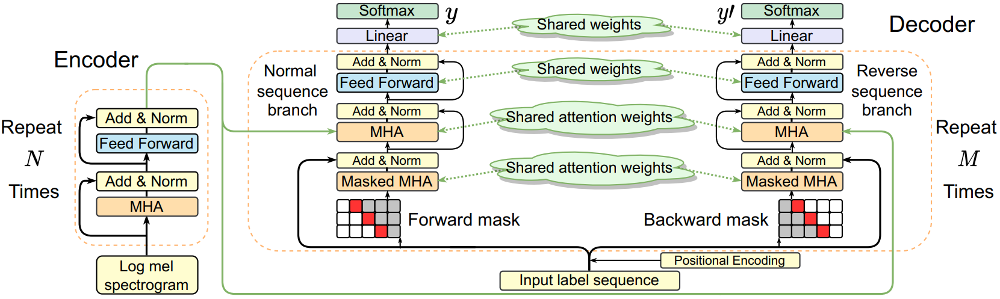
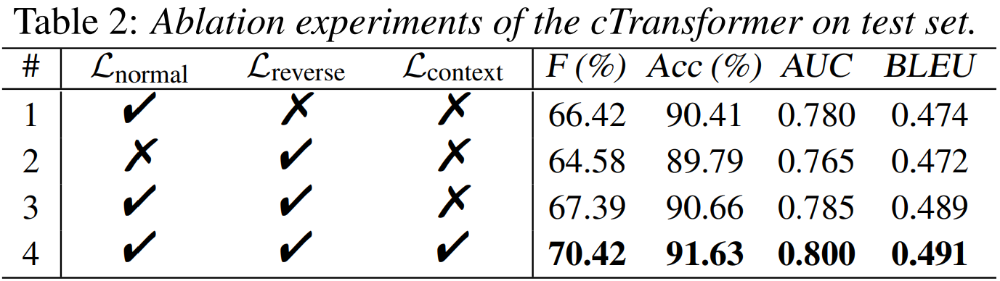

<!-- 在此处写注释-->
<!--

-->
# Model structure

 
The proposed contextual Transformer. In the forward and backward mask, the red, gray, and white blocks indicate the masked position of the information to be predicted, the position of the masked information, and the position of the available information. 
For the souce code, please see <a href="https://github.com/Yuanbo2020/Contextual-Transformer/tree/main/Code" 
target="https://github.com/Yuanbo2020/Contextual-Transformer/tree/main/Code">here</a>.

## Attention score

 
Attention score from the masked MHA in decoder. Subgraph (a) and (b) are from the normal and reverse sequence branches, respectively. The x-axis is each event predicted in an autoregressive way, y-axis is the corresponding reference event.

 
 

## Attention score of another two forward inference demos

 
Attention score from the masked MHA in decoder. Subgraph (a) and (b) are from the normal sequence branch with different audio clips, respectively. The x-axis is each event predicted in an autoregressive way, y-axis is the corresponding reference event.

 
 

# Experimental results
## Performance of the cTransformer with different numbers of encoder and decoder blocks.

 
 
 

## Ablation experiments of the cTransformer on test set.

 
 
 

## Performance of cTransformer, varying the loss weights.

 
 
 

## Comparison of AT and SAT results with prior works on recognizing audio event sequences.

 
 
 

 
